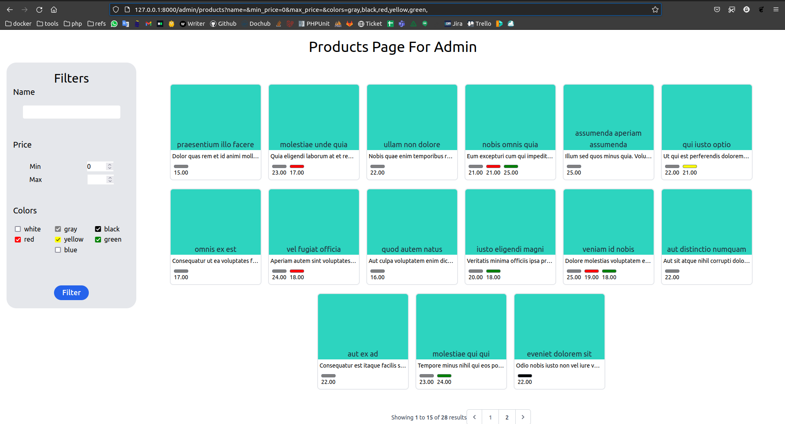

# Larave Api With Vue SPA

## @/api
```python
#install dependencies
composer install

#setup your .env

#migrate db
php artisan migrate

#seed database
php artisan db:seed --class="Modules\Product\Common\Database\Seeders\ProductSeeder"

#serve api
php artisan serve

```

## Now Check http://127.0.0.1:8000/admin/products

 

## @/spa
## SPA app is so simple just install dependencies and set api_url in .env...
